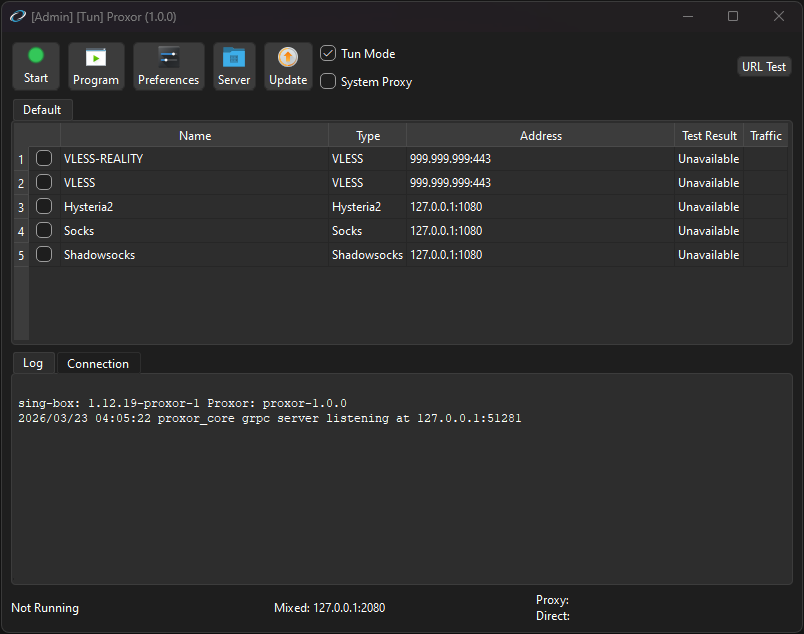

# Proxor

Qt-based proxy client for managing sing-box profiles, subscriptions, routing, and system proxy integration.

This fork ships the desktop GUI as `proxor` / `proxor.exe` and the backend core as `proxor_core` on top of the current sing-box integration used by this repository.

Current version: `1.0.0`

## Highlights

- Windows desktop builds
- Manual Linux build path
- sing-box based core workflow
- Profile management, subscriptions, routing, and traffic stats
- TUN mode and system proxy integration
- gRPC-based GUI/core communication

## Supported Proxy Types

- SOCKS (4/4a/5)
- HTTP(S)
- Shadowsocks
- VMess
- VLESS
- Trojan
- TUIC
- NaiveProxy
- Hysteria2
- Custom outbound
- Custom config
- Custom core

## Documentation

- [Build Windows](docs/Build_Windows.md)
- [Build Linux](docs/Build_Linux.md)
- [Build Core](docs/Build_Core.md)
- [Linux Runtime Guide](docs/Run_Linux.md)
- [Run Flags](docs/RunFlags.md)

## Runtime Notes

### Windows

If the application reports missing runtime DLLs, install the [Microsoft Visual C++ Redistributable](https://aka.ms/vs/17/release/vc_redist.x64.exe).

### Linux

Linux packaging and deployment vary by distribution. Use the local build and runtime guides in [`docs/`](docs/readme.md) instead of old third-party package references.
Linux remains manual-build only for now. `.deb`, AppImage, and CI-produced Linux release artifacts are not currently supported.

## Dependencies

### GUI and Native Build

- Qt 5.15 or Qt 6 Widgets/Network/Svg
- protobuf C++ (`v21.4` in `libs/build_deps_all.sh`)
- yaml-cpp (`0.7.0`)
- zxing-cpp (`2.0.0`)
- QHotkey

### Core and Go Toolchain

- Go `1.26.x`
- sing-box fork from the local workspace
- proxorlib from the local workspace
- gRPC `v1.79.3`
- protobuf-go `v1.36.11`

## Credits

- Original desktop project lineage: [MatsuriDayo/nekoray](https://github.com/MatsuriDayo/nekoray)
- Current backend foundation: `sing-box`, `sing`, and `proxorlib`
- UI/editor components adapted from [Qv2ray](https://github.com/Qv2ray/Qv2ray)
- Native libraries: Qt, protobuf, yaml-cpp, zxing-cpp, QHotkey
